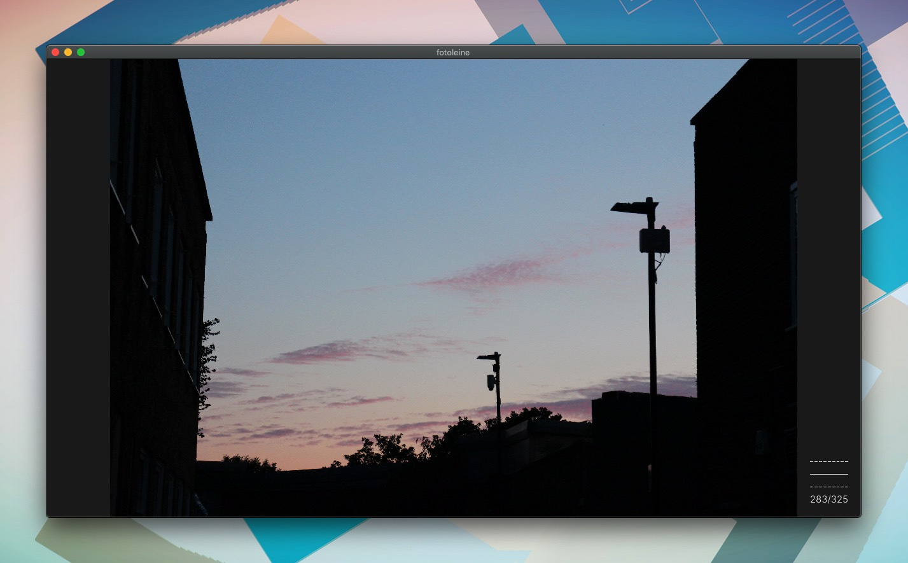

# Fotoleine
Fotoleine is a photo viewer designed for my workflow of reviewing the photos I have taken.
It supports loading a folder of JPG images, flicking through them in order, and assigning ratings to each.



## Usage

- **Loading:** Drag the folder into Fotoleine.
- **A/D:** Move to the previous/next image.
- **1/2/3:** Assign a low/medium/high rating to the currently shown image. The current rating for the shown image is displayed in the bottom left. Ratings are saved in a `ratings.yaml` file created in the loaded folder.
- **Cmd+1/2/3:** Set a filter to only display images with a low/medium/high rating.
- **Escape:** Clear any rating filter.
- **U:** Hide/Show the UI.
- **O:** Open the CR2 file with the same file name as the shown image from the loaded folder with the default program (MacOS specific).

## Features
- Upcoming images are preloaded in the background. This helps with responsiveness, particularly when loading images from an external hard drive.

## Limitations
- Only loads JPG files.
- Relies on file names to associate ratings. If you rename a file, make sure to change the corresponding line in the ratings.yaml file generated by Fotoleine.

## Install
_(Note: Fotoleine has only been tested on MacOS)_

Install [Rust](https://www.rust-lang.org/tools/install) (tested using rust version 1.36), then run:
```
git clone --recursive https://github.com/KeyMaster-/Fotoleine.git
cd Fotoleine
cargo run
```

[cargo-bundle](https://github.com/burtonageo/cargo-bundle) is supported.
Run `cargo bundle` to build and create an app for the platform you are on. See the cargo-bundle documentation for more details.
